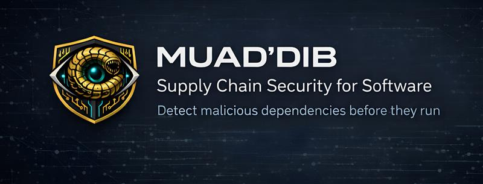

<p align="center">
  
</p>

<p align="center">
  <a href="https://www.npmjs.com/package/muaddib-scanner"></a>
  <a href="https://github.com/DNSZLSK/muad-dib/actions/workflows/scan.yml"></a>
  <a href="https://codecov.io/gh/DNSZLSK/muad-dib"></a>
  <a href="https://scorecard.dev/viewer/?uri=github.com/DNSZLSK/muad-dib"></a>
  
  
  
</p>

<p align="center">
  <a href="#installation">Installation</a> |
  <a href="#usage">Usage</a> |
  <a href="#features">Features</a> |
  <a href="#vs-code">VS Code</a> |
  <a href="#cicd">CI/CD</a>
</p>

<p align="center">
  <a href="docs/README.fr.md">Version francaise</a>
</p>

---

## Why MUAD'DIB?

npm and PyPI supply-chain attacks are exploding. Shai-Hulud compromised 25K+ repos in 2025. Existing tools detect threats but don't help you respond.

MUAD'DIB combines **<!--stat:scanners-->22<!--/stat:scanners--> parallel scanners** (<!--stat:rulesTotal-->278<!--/stat:rulesTotal--> detection rules), a **deobfuscation engine**, **inter-module dataflow analysis**, **compound scoring** (<!--stat:compound-->21<!--/stat:compound--> compound rules), and a gVisor/Docker sandbox to detect known threats and suspicious behavioral patterns in npm and PyPI packages. An XGBoost classifier exists in the codebase but is **currently inactive** (see [Evaluation](#evaluation)).

---

## Positioning

MUAD'DIB is a free, open, and fully auditable supply-chain scanner for npm and PyPI. It detects **known** threats (225,000+ IOCs), install-time RCE, credential-then-exfiltration flows, obfuscated payloads, and other suspicious behavioral patterns — locally, with no telemetry.

It is licensed under the **AGPL-3.0**; a **commercial license** is available for organizations that need to embed it in a proprietary product or run it as a closed hosted service (see [License](#license)).

It deliberately does not try to do everything — see [Scope](#scope) for exactly what it catches and what it does not.

---

## Scope

**Detects** (npm & PyPI): known-malicious packages (name + SHA256 IOC match), typosquats, install-time RCE (lifecycle `preinstall`/`postinstall`, `curl | sh`, Python import-time, `binding.gyp`), credential read then network exfiltration (intra- and cross-file), obfuscated / high-entropy / stub-loader payloads, binary droppers (`chmod +x` + exec/spawn), and anti-analysis evasion markers.

**Out of scope**: browser-only attacks (DOM/`window`, no Node.js API), the *contents* of native binaries / WASM (no binary analysis), zero-day unknown packages (the IOC feed is reactive), and non-npm/PyPI ecosystems (RubyGems, Maven, Go). Determined anti-sandbox fingerprinting and multi-stage remote payloads are known false-negative risks. Full detail: [Threat Model](docs/threat-model.md).

**No telemetry.** Your code and scan results never leave your machine — MUAD'DIB only *downloads* threat-intel feeds (`muaddib update`) and, for scoring, reads public npm registry metadata. Webhook alerts are opt-in.

---

## Installation

### npm (recommended)

```bash
npm install -g muaddib-scanner
```

### From source

```bash
git clone https://github.com/DNSZLSK/muad-dib
cd muad-dib
npm install
npm link
```

---

## Usage

### Basic scan

```bash
muaddib scan .
muaddib scan /path/to/project
```

Scans both npm (package.json, node_modules) and Python (requirements.txt, setup.py, pyproject.toml) dependencies.

### Interactive mode

```bash
muaddib
```

### Safe install

```bash
muaddib install <package>
muaddib install lodash axios --save-dev
muaddib install suspicious-pkg --force    # Force install despite threats
```

Scans packages for threats BEFORE installing. Blocks known malicious packages.

### Risk score

Each scan displays a 0-100 risk score:

```
[SCORE] 58/100 [***********---------] HIGH
```

### Explain mode

```bash
muaddib scan . --explain
```

Shows rule ID, MITRE ATT&CK technique, references, and response playbook for each detection.

### Export

```bash
muaddib scan . --json > results.json     # JSON
muaddib scan . --html report.html        # HTML
muaddib scan . --sarif results.sarif     # SARIF (GitHub Security)
```

### Severity threshold

```bash
muaddib scan . --fail-on critical  # Fail only on CRITICAL
muaddib scan . --fail-on high      # Fail on HIGH and CRITICAL (default)
```

### Paranoid mode

```bash
muaddib scan . --paranoid
```

Ultra-strict detection with lower tolerance. Detects any network access, subprocess execution, dynamic code evaluation, and sensitive file access.

### Webhook alerts

```bash
muaddib scan . --webhook "https://discord.com/api/webhooks/..."
```

Strict filtering (v2.1.2): alerts only for IOC matches, sandbox-confirmed threats, or canary token exfiltration. Priority triage (v2.10.21): P1 (red, IOC/sandbox/canary), P2 (orange, high-score/compounds), P3 (yellow, rest).

### Behavioral anomaly detection (v2.0)

```bash
muaddib scan . --temporal-full     # All 4 temporal features
muaddib scan . --temporal          # Sudden lifecycle script detection
muaddib scan . --temporal-ast      # AST diff between versions
muaddib scan . --temporal-publish  # Publish frequency anomaly
muaddib scan . --temporal-maintainer # Maintainer change detection
```

Detects supply-chain attacks **before** they appear in IOC databases by analyzing changes between package versions. See [Evaluation Methodology](docs/EVALUATION_METHODOLOGY.md) for details.

### Docker sandbox

```bash
muaddib sandbox <package-name>
muaddib sandbox <package-name> --strict
```

Dynamic analysis in an isolated Docker container: strace, tcpdump, filesystem diff, canary tokens, CI-aware environment, and monkey-patching preload for time-bomb detection (multi-run at [0h, 72h, 7d] offsets).

### Other commands

```bash
muaddib watch .                    # Real-time monitoring
muaddib daemon                     # Daemon mode (auto-scan npm install)
muaddib update                     # Update IOCs (fast, ~5s)
muaddib scrape                     # Full IOC refresh (~5min)
muaddib diff HEAD~1                # Compare threats with previous commit
muaddib init-hooks                 # Pre-commit hooks (husky/pre-commit/git)
muaddib scan . --breakdown         # Explainable score decomposition
muaddib replay                     # Ground truth validation (90/94 TPR@3, v2.11.48)
```

---

## Features

### <!--stat:scanners-->22<!--/stat:scanners--> parallel scanners

| Scanner | Detection |
|---------|-----------|
| AST Parse (acorn) | eval, Function, credential theft, binary droppers, prototype hooks |
| Pattern Matching | Shell commands, reverse shells, dead man's switch |
| Dataflow Analysis | Credential read + network send (intra-file and cross-file) |
| Obfuscation Detection | JS obfuscation patterns (skip .min.js) |
| Deobfuscation Pre-processing | String concat, charcode, base64, hex array, const propagation |
| Inter-module Dataflow | Cross-file taint propagation (3-hop chains, class methods) |
| Intent Coherence | Intra-file source-sink pairing (credential + eval/network) |
| Typosquatting | npm + PyPI (Levenshtein distance) |
| Python Scanner | requirements.txt, setup.py, pyproject.toml, 14K+ PyPI IOCs |
| Shannon Entropy | High-entropy strings (5.5 bits + 50 chars min) |
| AI Config Scanner | .cursorrules, CLAUDE.md, copilot-instructions.md injection |
| Package/Dependencies | Lifecycle scripts, IOC matching (225K+ packages) |
| GitHub Actions | Shai-Hulud backdoor detection |
| Hash Scanner | Known malicious file hashes |
| IOC Strings (intel-triage P1.1) | YARA-style string matching (Axios 2026, TeamPCP, GlassWorm, CanisterSprawl) |
| Anti-Forensic AST (intel-triage P1.2) | XOR loop + self-delete + decoy write compound (csec autodelete) |
| Stub Package (intel-triage P1.3) | Tiny main file + external dep URL + lifecycle hook (ltidi chain) |
| Monorepo Scanner | Lerna/pnpm-workspace/turbo detection (Sprint 1 audit MR-C2 fix) |
| Trusted-Dep-Diff (opt-in) | Diff against trusted dep tarballs from registry (v2.10.x) |
| Python Source (PYSRC) | Import-time / install-time RCE patterns in `__init__.py` / `setup.py` (v2.11.41 — closes TrapDoor PyPI gap) |
| Python AST (PYAST) | Tree-sitter-Python AST with taint-aware detectors (v2.11.42+) |
| Anti-Scanner Injection (ASI) | Prompt-injection text in comments/strings that coerces an LLM code reviewer into a clean verdict or into skipping an obfuscated payload (ASI-001..004, Hades campaign 2026-06) |

### <!--stat:rulesTotal-->278<!--/stat:rulesTotal--> detection rules

All rules (<!--stat:rulesCore-->273<!--/stat:rulesCore--> RULES + <!--stat:rulesParanoid-->5<!--/stat:rulesParanoid--> PARANOID) are mapped to MITRE ATT&CK techniques. See [SECURITY.md](SECURITY.md#detection-rules) for the complete rules reference.

### Detected campaigns

| Campaign | Status |
|----------|--------|
| GlassWorm (2026, 433+ packages) | Detected |
| Shai-Hulud v1/v2/v3 (2025) | Detected |
| event-stream (2018) | Detected |
| eslint-scope (2018) | Detected |
| Protestware (node-ipc, colors, faker) | Detected |
| Typosquats (crossenv, mongose, babelcli) | Detected |

---

## VS Code

The VS Code extension automatically scans your npm projects.

```bash
code --install-extension dnszlsk.muaddib-vscode
```

- `MUAD'DIB: Scan Project` - Scan entire project
- `MUAD'DIB: Scan Current File` - Scan current file
- Settings: `muaddib.autoScan`, `muaddib.webhookUrl`, `muaddib.failLevel`

See [vscode-extension/README.md](vscode-extension/README.md) for full documentation.

---

## CI/CD

### GitHub Actions (Marketplace)

Minimal (fail the build on HIGH+ threats, single scan):

```yaml
name: Security Scan

on: [push, pull_request]

jobs:
  scan:
    runs-on: ubuntu-latest
    steps:
      - uses: actions/checkout@v4
      - uses: DNSZLSK/muad-dib@v2.11.180   # pin to a released tag
        with:
          fail-on: 'high'
```

With SARIF uploaded to the **Security** tab (needs `security-events: write`; runs a second pass to emit SARIF):

```yaml
jobs:
  scan:
    runs-on: ubuntu-latest
    permissions:
      contents: read
      security-events: write
    steps:
      - uses: actions/checkout@v4
      - uses: DNSZLSK/muad-dib@v2.11.180
        with:
          path: '.'
          fail-on: 'high'
          sarif: 'results.sarif'
```

**Inputs**

| Input | Description | Default |
|-------|-------------|---------|
| `path` | Path to scan | `.` |
| `fail-on` | Minimum severity to fail (`critical`/`high`/`medium`/`low`/`none`) | `high` |
| `sarif` | SARIF output file path — set to also upload to the Security tab | |
| `paranoid` | Ultra-strict detection (higher FPR) | `false` |
| `version` | `muaddib-scanner` npm version to install | `latest` |

**Outputs** (consume in later steps via `steps.<id>.outputs.*`)

| Output | Description |
|--------|-------------|
| `risk-score` | Risk score 0–100 |
| `risk-level` | `SAFE` / `LOW` / `MEDIUM` / `HIGH` / `CRITICAL` |
| `threats-count` | Total threats detected |
| `critical-count` / `high-count` | Threats by severity |
| `exit-code` | `0` = passed the `fail-on` gate, non-zero otherwise |
| `sarif-file` | Path to the SARIF file (empty if `sarif` not set) |

### Pre-commit hooks

```bash
muaddib init-hooks                        # Auto-detect (husky/pre-commit/git)
muaddib init-hooks --type husky           # Force husky
muaddib init-hooks --mode diff            # Only block NEW threats
```

With pre-commit framework:
```yaml
repos:
  - repo: https://github.com/DNSZLSK/muad-dib
    rev: v2.11.139
    hooks:
      - id: muaddib-scan
```

---

## Evaluation

Last measured **v2.11.48** (2026-05-26), **rules-only** (the ML classifier is inactive — see below). Ground truth: 94 in-scope real-world attacks + 200 random npm + 124 PyPI + 107 adversarial/holdout.

| Metric | Result |
|--------|--------|
| Detection rate (TPR@3) | **95.74%** (90/94) |
| Alert rate (TPR@20) | **88.30%** (83/94) |
| FPR — curated npm (548) | **1.10%** (6/545) |
| FPR — random npm (200) | **2.50%** (5/200) |
| FPR — PyPI (132) | **9.68%** (12/124) |
| ADR — adversarial + holdout | **96.26%** (103/107) |
| Wild TPR (Datadog 17K) | **92.8%** (13,538/14,587) |

**ML classifier: inactive.** An XGBoost model lives in `src/ml/` but is never wired into `muaddib scan`, and runs LOG-ONLY in the monitor since 2026-04-08 (the trained model collapsed, pending retrain). All numbers above are rules-only.

Full protocol, per-track history, the PyPI cap-35 caveat, operational (GHSA-denominated) coverage, and the ML retrain methodology: [Evaluation Methodology](docs/EVALUATION_METHODOLOGY.md).

---

## Contributing

### Add IOCs

Edit YAML files in `iocs/`:

```yaml
- id: NEW-MALWARE-001
  name: "malicious-package"
  version: "*"
  severity: critical
  confidence: high
  source: community
  description: "Threat description"
  references:
    - https://example.com/article
  mitre: T1195.002
```

### Development

```bash
git clone https://github.com/DNSZLSK/muad-dib
cd muad-dib
npm install
npm test
```

### Testing

- **<!--stat:tests-->4545<!--/stat:tests--> tests** across <!--stat:testFiles-->155<!--/stat:testFiles--> modular test files
- **56 fuzz tests** - Malformed inputs, ReDoS, unicode, binary
- **Datadog 17K benchmark** - 14,587 confirmed malware samples (in-scope)
- **Ground truth validation** - 96 real-world attacks (95.74% TPR@3, 88.30% TPR@20 — v2.11.48 full measure on 94 in-scope)
- **False positive validation** (v2.11.48 measure) - 1.10% FPR rules (6/545 scanned), 2.50% on 200 random, 9.68% on 124/132 PyPI (first honest measurement post-Track-D download fix). ML classifier currently inactive — see Evaluation Metrics → ML Classifier.

---

## Community

- Discord: https://discord.gg/y8zxSmue

---

## Documentation

- [Blog](https://dnszlsk.github.io/muad-dib/blog/) - Technical articles on supply-chain threat detection
- [Carnet de bord](docs/CARNET_DE_BORD_MUADDIB.md) - Development journal (in French)
- [Documentation Index](docs/INDEX.md) - All documentation in one place
- [Evaluation Methodology](docs/EVALUATION_METHODOLOGY.md) - Experimental protocol, holdout scores
- [Threat Model](docs/threat-model.md) - What MUAD'DIB detects and doesn't detect
- [Security Policy](SECURITY.md) - Detection rules reference (<!--stat:rulesTotal-->278<!--/stat:rulesTotal--> rules)
- [Security Audit](docs/SECURITY_AUDIT.md) - Bypass validation report
- [FP Analysis](docs/EVALUATION.md) - Historical false positive analysis

---

## License

MUAD'DIB is licensed under the **GNU Affero General Public License v3.0 only** (`AGPL-3.0-only`) — see [LICENSE](LICENSE) and [NOTICE](NOTICE).

You are free to use, study, modify, and redistribute it — including over a network — provided that derivative works and network-deployed modifications are released under the same license.

**Commercial licensing:** to embed MUAD'DIB in a proprietary / closed-source product, or to offer it as a hosted service without the AGPL's source-disclosure obligations, a separate commercial license is available. Open an issue or contact the author ([DNSZLSK](https://github.com/DNSZLSK)).

Copyright (C) 2026 DNSZLSK.

---

<p align="center">
  <strong>The spice must flow. The worms must die.</strong>
</p>
